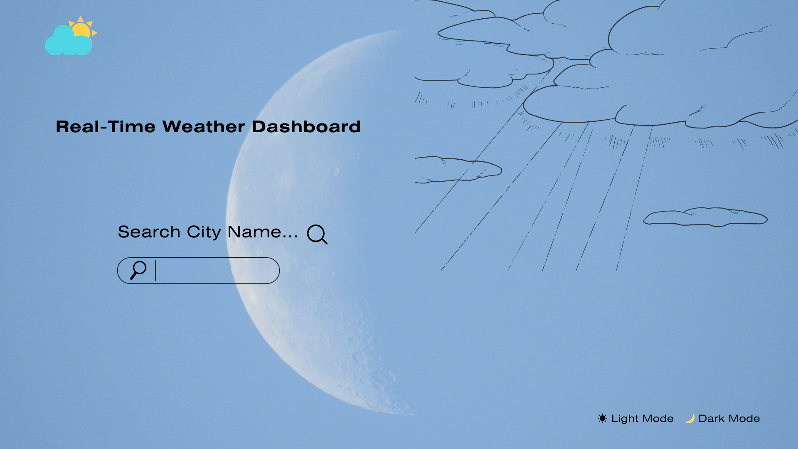
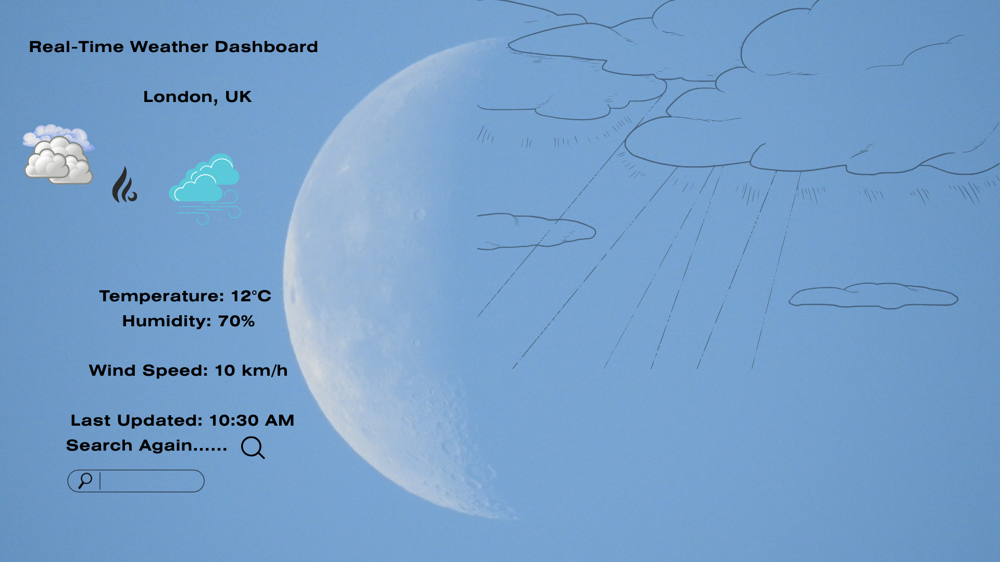

# Real-Time Weather Dashboard

## Project Overview

This project presents a Real-Time Weather Dashboard that allows users to search for weather information for different cities. The application retrieves live weather data from an external API and displays key information such as temperature, humidity, and wind speed in a clear and user-friendly interface. The system has been fully developed using React and deployed using Vercel. It includes features such as real-time data updates, responsive design, error handling for invalid inputs, and an optional light/dark mode for improved user experience. The project demonstrates the practical application of modern web development technologies, including API integration, component-based architecture, and front-end deployment.

## Contributors

- Ifra
- Rabia
- Mst

##  Live Website
https://real-time-weather-dashboard-three.vercel.app/

## Features
- Search weather by city name
- Display temperature, humidity, and wind speed
- Real-time weather data retrieval using API
- User-friendly dashboard interface
- Error message for invalid city input
- Optional light mode / dark mode interface

## Technology Stack

The following technologies were used to develop and deploy the Real-Time Weather Dashboard:

### Frontend

* **React** – Used to build the user interface with a component-based architecture
* **CSS** – Used for styling and layout design
* **JavaScript (ES6)** – Used for application logic and API handling

### Build Tool

* **Vite** – Used for fast development and optimized production builds

### API Integration

* **Open-Meteo API** – Used to fetch real-time weather data including temperature, humidity, and wind speed

### Deployment

* **Vercel** – Used to host and deploy the application online

### Development Tools

* **Git & GitHub** – Used for version control and project management
* **Visual Studio Code** – Used as the code editor

### Architecture

* The application follows a **frontend-only architecture**, where all logic runs on the client side and data is retrieved directly from an external API without a custom backend.


## Project Management
The development process follows the Scrum methodology. Tasks are organised using a Trello board with the following workflow:

- To Do
- Doing
- Testing / Review
- Done

This allows the team to track development progress and manage tasks effectively.

## Current Status
The project has been successfully completed and deployed. All major features including real-time weather search, UI design, error handling, and API integration have been implemented and tested. The application is fully functional and accessible via the deployed Vercel link.


## Project Overview
- Software Development Methodology 
- Requirements Analysis 
- Legal, Social, Ethical, Economic and Commercial Considerations
- Technical Review
- Design
- Development and Testing

## System Design

The following diagrams illustrate the design of the Real-Time Weather Dashboard.

### Use Case Diagram


### User Persona


## High-Fidelity UI Designs

### Search Interface


### Weather Dashboard


### Error Handling


## A3 Project Poster


## Repository Structure

The project follows a structured and organised folder layout:

```
real-time-weather-dashboard/
│── public/              # Static files (HTML, icons, images)
│── src/                 # Main application source code
│   │── App.jsx          # Main React component (UI + logic)
│   │── App.css          # Styling for the application
│   │── index.css        # Global styles
│   │── main.jsx         # Entry point of the React app
│
│── index.html           # Root HTML file
│── package.json         # Project dependencies and scripts
│── vite.config.js       # Vite configuration file
```

### Description

* The **src folder** contains all the main application logic and components.
* The **public folder** stores static assets such as images and icons.
* **App.jsx** is the core component responsible for handling user input, API calls, and displaying weather data.
* **main.jsx** is the entry point that renders the React application.
* **index.html** is the base HTML file used by Vite.
* **package.json** manages dependencies and project scripts.
* **vite.config.js** is used to configure the build tool.

This structure ensures the project is modular, maintainable, and easy to understand.

